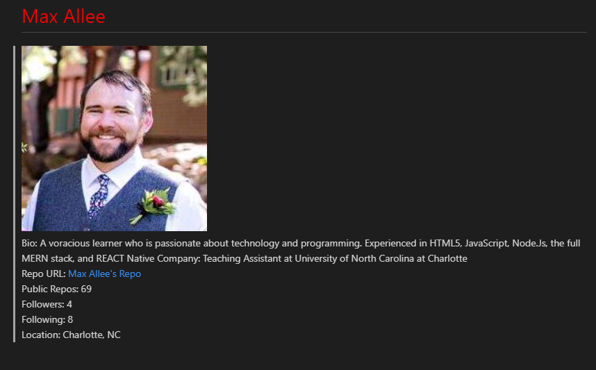

# Developer-Profile-Generator

## Table of contents
* [General info](#general-info)
* [Instruction](#instructions)
* [Screenshots](#screenshots)
* [Features](#features)

## General info
This app will run in NodeJS and feature dynamically created markdown and pdf version of their GitHub resume.
The user will be prompted for a favorite color, which will be used as the color of users name.

The  MarkDown will be populated with the following:

* Profile image
* User name
* Link to User GitHub profile location  
* User bio
* Number of public repositories
* Number of followers
* Number of users following

## Instructions
AS AN employee with a busy schedule  
I WANT to add important events to a daily planner  
SO THAT I can manage my time effectively

[enter in bash] node index.js to start program

## Built With

* node.js  
* npm modules: axios, inquirer, fs, pdfkit  

## Screenshots
  
  
  

## Features
List of features ready and TODOs for future development
* The current day is displayed at the top of the calendar 
* The application displays timeblocks for standard business hours (9 a.m. to 5 p.m.)  
* Each timeblock contains an input field and save button  
* Clicking a timeblock's "Save" button stores the input text in local storage, allowing the text to persist when the application is refreshed.
* Each timeblock is color coded to indicate whether it is in a past, present, or future hour.

